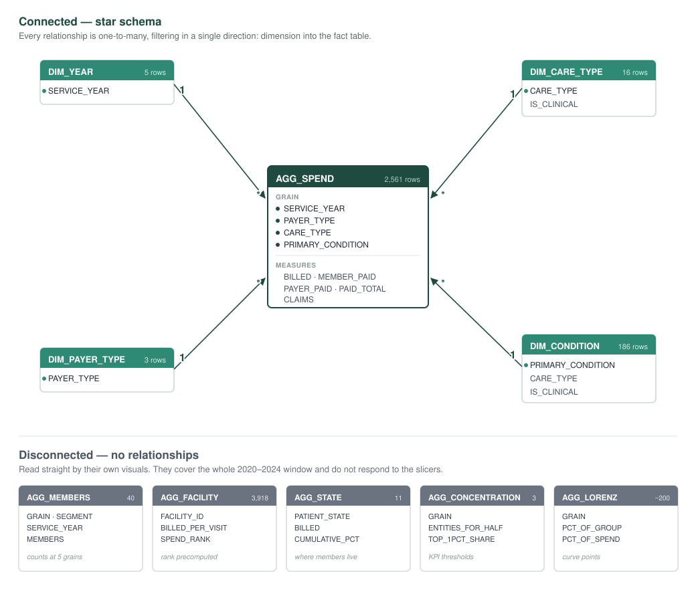

# Calder Claims Dashboard: Power BI

**Where does healthcare spending concentrate by care type, and how does member cost burden vary by payer type?**

Three pages built on ten pre-aggregated Snowflake tables. Every calculation that could be done in SQL was done in SQL. Power BI reads finished numbers and does no transformation.

---

## Data model

### Why it's modelled this way

Every relationship is **one-to-many, single direction**: dimension into `AGG_SPEND`. Each dimension holds one row per value; the fact table holds many rows carrying it. The dimensions exist so slicers have somewhere to sit: a slicer built on the fact table filters only that table, and single-direction arrows keep filters from looping back on themselves.

### Why five tables are disconnected

`AGG_MEMBERS` is separate because member counts don't add up: one person shows up under several care types, so summing double-counts them. The four facility and geography tables carry rank and running totals that are already computed in SQL, because doing that in DAX doesn't finish at 1.26M members. The trade-off is that they cover the whole 2020–2024 window and don't respond to the Year or Payer slicers, so every card built on them says so.

---

## Page 1: Overview

**Spending Drivers by Care Type.** Maternity is the largest single driver at $29bn, ahead of dental and oral care at $12bn and allergy and immune at $9bn. The bar colour is member paid share, so length and colour say different things: maternity is the biggest bill but a pale bar, while smaller care types run darker. The $26bn sitting under "No diagnosis on claim" is the second-largest bar on the page: that is a data limitation shown rather than hidden, and members carry 28.3% of it against 17.6% of diagnosed care.

**Total Spend and Member Cost Over Time.** Spend holds flat near $20bn a year from 2020 to 2023, and cost per member barely moves: $18.1K, $17.6K, $17.7K, $17.8K. The drop to $16.8bn in 2024 is not a trend: the data stops on 9 November 2024, so the year is about 15% short.

**Spend by Plan Type.** Government plans cover $52.51bn (53.0%), commercial $39.59bn (40.0%), and self-pay $7bn (7.1%).

**Member Cost Share by Plan Type.** This is the answer to the second half of the question, and it is the sharpest result on the dashboard. Commercial members pay **30.0%** of their bill. Government members pay **2.7%**. Same care, roughly 11× the burden. Self-pay is 100% by definition. Because these are ratios, they survive the pricing defect in the source data that makes every dollar figure suspect: scaling a bill and its payment by the same factor cancels out.

**Why this matters.** Maternity is the biggest line in the book, so it is where contract negotiation returns the most. And an 11× burden gap between commercial and government members is a benefit design choice, not a fact of the care.

---

## Page 2: Cost Concentration

**Care Type Spend Concentration.** Of $99.11bn billed, $72.69bn has a usable diagnosis. Within that, **2 of 15 care types account for half the spend**. The cumulative line reaches 50% before the third bar and flattens by the seventh: everything after that is rounding.

**Member paid share by care type and plan type.** The matrix is where the two halves of the question meet. The gap holds across the board, not in one or two places: respiratory and ENT runs 44.5% commercial against 5.8% government, injury and trauma 44.4% against 4.0%, brain and nervous system 40.2% against 4.1%. The overall row is 22.7% against 1.9%. The pattern is structural, not a mix effect from one expensive care type.

**Top conditions.** Sorting by member paid share instead of spend separates two things that look alike. Non-small cell lung cancer bills $3.38bn and leaves the member 5.4%. Normal pregnancy bills $28.93bn, nearly ten times as much, and leaves the member 17.0%. Cancer is expensive to the plan; pregnancy is expensive to the person. Ranking conditions by cost alone would show only the first of those.

**Why this matters.** Two care types carrying half the spend is a short enough list to act on. And because the burden gap holds across every care type, the fix is commercial cost-sharing rather than a programme aimed at one condition.

---

## Page 3: Facility & Geography

Supplementary to the main question: where care is delivered, and where members live.

**Spend Concentration: Facilities vs. Members.** Two curves on one chart, and the gap between them is the finding. Facilities bend hard: **86 of 3,918 carry half of all spend**, and the top 1% carry 32.9%. Members bend much less; it takes 134,198 of them to reach the same halfway mark. Cost is concentrated in a small set of places far more than in a small set of people.

**Spend by State.** Members live in 11 states, and **3 of them carry half the spend**: consistent with a client footprint centred on Cleveland, Chicago and Detroit. This maps where members live (`PATIENT_STATE`), not where care was delivered (`FACILITY_STATE`); they are separate columns and should not be read as one.

**Top 20 Facility Spenders (scatter).** Billed per visit against members served, with bubble size for total billed. It separates two ways of being expensive. The cluster near $5K per visit serves ordinary volumes at ordinary prices. The points out at $22K–$30K per visit are the specialty and dialysis-heavy sites: few members, high intensity, and a total that rivals the large systems.

**Top 20 Facility Spenders (bar).** The named ranking behind the curve. Cleveland Clinic East Region leads at $2.7bn, then University Hospitals Cleveland at $2.4bn and St Vincent Charity at $2.4bn. The top five are all Cleveland systems, which is the concentration KPI made concrete.

**Why this matters.** 86 facilities is a list a contracting team can work through, and the top five sitting in one metro area is real leverage. A site that is expensive because it is busy needs a different response than one where each visit costs a fortune.

---

## The SQL behind it

The dashboard reads finished tables. Each layer below is the input to the one under it.

| Layer | What it does | Code |
|---|---|---|
| Base view | Fixes six documented traps in the raw share: running balances, transfer rows, and who actually paid | [`v_claims_tx_clean.sql`](../sql/ddl/v_claims_tx_clean.sql) |
| Code dictionary | Maps every clinical code to one canonical name and category | [`code_dictionary_raw.sql`](../sql/ddl/code_dictionary_raw.sql), [`code_dictionary_classify.sql`](../sql/ddl/code_dictionary_classify.sql) |
| Care-type view | Adds care type, primary condition, facility and member state | [`v_claims_tx_with_caretype.sql`](../sql/ddl/v_claims_tx_with_caretype.sql) |
| Aggregate tables | All ten tables in the model, with an acceptance check at the end | [`powerbi_model_build.sql`](../sql/ddl/powerbi_model_build.sql) |
| Measures | Every DAX measure | [`measures.dax`](measures.dax) |

The written analysis these figures come from is in [`dashboard/analysis_report.html`](../dashboard/analysis_report.html), which also carries the caveats on pricing, the short 2024, and what this dataset cannot answer.

---

## Tech stack

Snowflake · SQL · Power BI Desktop (Import mode) · DAX
